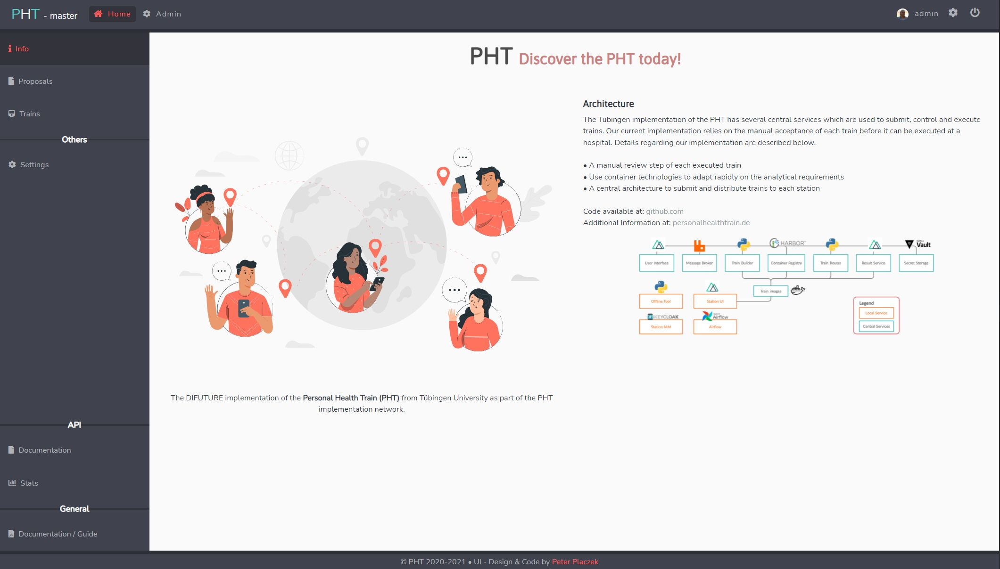

# Central 🐋
This repository contains the main central packages of the Personal Health Train (PHT).

[](https://github.com/PHT-Medic/central/actions/workflows/main.yml)
[](https://github.com/PHT-Medic/central/actions/workflows/codeql.yml)
[](https://snyk.io/test/github/PHT-Medic/central)
[](https://conventionalcommits.org)



**Table of Contents**

- [Installation & Build](#installation--build)
- [Configuration](#configuration)
- [Packages](#packages)
- [Usage](#usage)
- [Credits](#credits)
- [License](#license)

## Installation & Build
Download the source code.

```shell
$ git clone https://github.com/PHT-Medic/central
$ cd central
```

In addition, `Node.js` must be installed on the host machine, to start packages and to install required dependencies.
To install the dependencies, run:

```shell
$ npm i
```

To build all packages, run:

```shell
$ npm run build
```

## Configuration
Read the `README.md` in each package directory. Each package must be configured individually.

## Packages

The repository contains the following packages:

- **@personalhealthtrain/central-api** 🌴: This package contains aggregators, components and many more.
- **@personalhealthtrain/central-common** 🧱: This package contains common constants, functions, types, ...
- **@personalhealthtrain/central-ui** 🧸: This package contains the User Interface.
- **@personalhealthtrain/central-realtime** 🚄: This package contains the realtime application which connects the API with socket based clients.
- **@personalhealthtrain/central-train-manager** 🏭: This package contains the train manager, which is responsible to route, build and extract a train.

## Usage
Start the ui-, api-, & realtime-application in a single terminal window (or as background process) with the following command:
```shell
$ npm run api
```

```shell
$ npm run ui
```

```shell
$ npm run realtime
```

```shell
$ npm run train-manager
```

## Credits
If you have any questions, feel free to contact the author & creator [Peter Placzek](https://github.com/tada5hi)  of the project.
The project was initial developed during this bachelor thesis, and he worked after that time as employee
on the project.

## License

Made with 💚

Published under [MIT License](./LICENSE).
